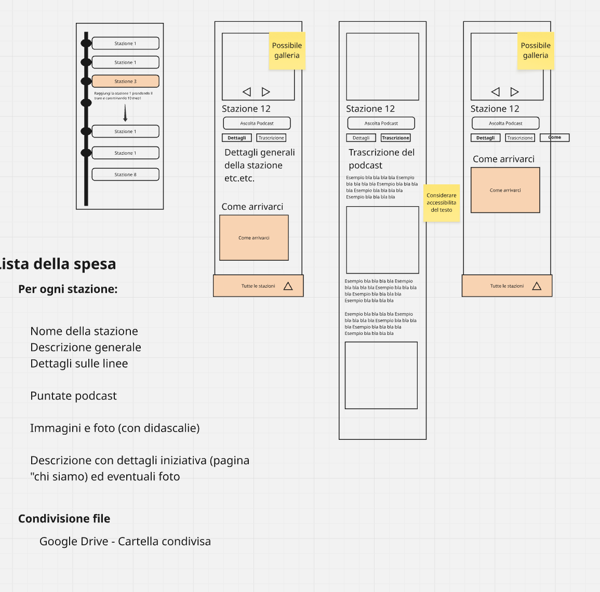

# Pinocchio Bicentenario - Sesto Fiorentino

Sito web per il bicentenario di Pinocchio, realizzato da un'associazione a tutela delle disabilità di Sesto Fiorentino.

## Panoramica del Progetto

Il sito ospita informazioni su **12 stazioni** distribuite nel territorio di Sesto Fiorentino, ciascuna collegata a una puntata di un podcast dedicato all'evento.

### Caratteristiche Principali

- **12 pagine stazione** con dettagli, galleria fotografica e riferimenti al podcast
- **Lista stazioni** con visualizzazione a timeline
- **Pagina About** con informazioni sull'iniziativa e l'associazione
- **Accessibilità**: priorità assoluta, dato il coinvolgimento di un'associazione a tutela delle disabilità

### Struttura Pagina Stazione

Ogni pagina stazione include:

1. **Galleria immagini** (opzionale) con navigazione
2. **Player/link podcast** per ascoltare la puntata correlata (Spotify, Apple Podcasts, MP3 diretto)
3. **Due tab**:
   - **Dettagli**: informazioni sulla stazione + indicazioni su come arrivarci
   - **Trascrizione**: testo e immagini in formato articolo (per accessibilità)

### Requisiti di Accessibilità

- WCAG 2.1 livello AA come minimo
- Navigazione da tastiera completa
- Screen reader friendly
- Contrasto adeguato (4.5:1 minimo)
- Testi alternativi per tutte le immagini
- Trascrizioni complete dei podcast
- Skip link per il contenuto principale
- Supporto per riduzione movimento e alto contrasto

## Wireframe



## Stato del Progetto

🟢 **Struttura base completata**

- [x] Setup progetto Astro
- [x] Configurazione Decap CMS
- [x] Design system accessibile
- [x] Layout base con header/footer
- [x] Pagina lista stazioni con timeline
- [x] Pagina dettaglio stazione con tabs
- [x] Podcast player (Spotify, Apple, MP3)
- [x] Pagina Chi siamo
- [ ] Contenuti delle 12 stazioni
- [ ] Immagini e audio
- [ ] Deploy su Vercel
- [ ] Configurazione autenticazione CMS

---

## Stack Tecnologico

| Componente | Scelta | Costo |
|------------|--------|-------|
| Framework | **Astro** | €0 |
| CMS | **Decap CMS** | €0 |
| Hosting | **Vercel** | €0 |
| Dominio | Vercel gratuito (per ora) | €0 |

**Totale: €0**

---

## Quick Start

### Sviluppo locale

```bash
# Installa dipendenze
npm install

# Avvia server di sviluppo
npm run dev

# Il sito sarà disponibile su http://localhost:4321
```

### Build e preview

```bash
# Crea build di produzione
npm run build

# Preview della build
npm run preview
```

### CMS locale (per sviluppo)

Per usare Decap CMS in locale:

1. Decommenta `local_backend: true` in `public/admin/config.yml`
2. Installa il proxy: `npx decap-server`
3. Vai su `http://localhost:4321/admin`

---

## Struttura del Progetto

```
pinocchio-bicentenario/
├── public/
│   ├── admin/           # Decap CMS
│   │   ├── index.html
│   │   └── config.yml   # Configurazione CMS
│   ├── images/          # Immagini del sito
│   │   └── stations/    # Immagini delle stazioni
│   ├── audio/           # File MP3 podcast
│   └── wireframe.png
├── src/
│   ├── content/
│   │   ├── stations/    # Contenuti stazioni (markdown)
│   │   ├── pages/       # Pagine statiche
│   │   └── settings/    # Impostazioni globali
│   ├── layouts/
│   │   └── BaseLayout.astro
│   ├── pages/
│   │   ├── index.astro
│   │   ├── chi-siamo.astro
│   │   └── stazioni/
│   │       ├── index.astro
│   │       └── [slug].astro
│   └── styles/
│       ├── design-tokens.css
│       └── global.css
├── CLAUDE.md            # Istruzioni per Claude Code
└── README.md
```

---

## Gestione Contenuti

### Come modificare i contenuti (per non-tecnici)

1. Vai su `https://tuosito.vercel.app/admin`
2. Accedi con il tuo account
3. Seleziona la sezione da modificare (Stazioni, Pagine, Impostazioni)
4. Modifica i contenuti usando l'editor visuale
5. Clicca "Pubblica" per salvare

Le modifiche saranno online automaticamente.

### Aggiungere una nuova stazione

Nel CMS:
1. Vai su "Stazioni" → "Nuova stazione"
2. Compila tutti i campi richiesti
3. Carica le immagini
4. Aggiungi i link al podcast
5. Scrivi la trascrizione
6. Pubblica

### Struttura di una stazione

```yaml
title: "Nome della stazione"
order: 1  # Numero della stazione (1-12)
description: "Breve descrizione"
heroImage: "/images/stations/stazione-01.jpg"
gallery:
  - image: "/images/stations/gallery-1.jpg"
    caption: "Descrizione immagine"
    alt: "Testo alternativo per screen reader"
podcast:
  episodeTitle: "Titolo episodio"
  spotifyUrl: "https://open.spotify.com/..."
  applePodcastsUrl: "https://podcasts.apple.com/..."
  mp3File: "/audio/episodio-01.mp3"
  duration: "15:30"
directions:
  address: "Via Example 1, Sesto Fiorentino"
  coordinates: "43.8456, 11.1987"
  mapsUrl: "https://maps.google.com/..."
  instructions: "Indicazioni dettagliate..."
published: true
```

---

## Deploy su Vercel

### Prima volta

1. Vai su [vercel.com](https://vercel.com) e accedi con GitHub
2. Clicca "Add New Project"
3. Importa il repository `pinocchio-bicentenario`
4. Vercel rileverà automaticamente Astro
5. Clicca "Deploy"

### Configurazione Decap CMS con Netlify Identity

Per permettere il login al CMS:

1. Vai su [app.netlify.com](https://app.netlify.com)
2. Crea un nuovo sito dal repository (solo per Identity)
3. Abilita Netlify Identity nelle impostazioni
4. Invita gli utenti che devono modificare i contenuti
5. Aggiorna `public/admin/config.yml` con il backend corretto

Alternativa: usa GitHub OAuth backend per autenticazione diretta con GitHub.

---

## Palette Colori

I colori sono ispirati al mondo di Pinocchio:

- **Primary (Legno)**: `#9a6b35` - toni caldi del legno
- **Secondary (Verde Toscana)**: `#3d7d66` - natura toscana
- **Accent (Blu notte)**: `#476688` - avventure notturne

Tutti i colori rispettano WCAG 2.1 AA per il contrasto.

---

## Contenuti per Stazione

Per ogni stazione servono:

- [ ] Nome della stazione
- [ ] Descrizione breve (per la lista)
- [ ] Descrizione completa (per la pagina)
- [ ] Immagine principale (hero)
- [ ] 2-4 immagini galleria con didascalie e alt text
- [ ] Link podcast Spotify
- [ ] Link podcast Apple Podcasts
- [ ] File MP3 (opzionale)
- [ ] Indirizzo completo
- [ ] Coordinate GPS
- [ ] Indicazioni per arrivarci
- [ ] Trascrizione completa del podcast

---

## Licenza

© 2026 Pinocchio Bicentenario. Tutti i diritti riservati.
